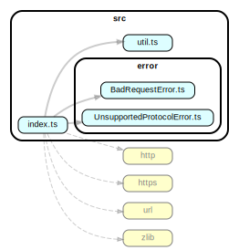

# make-request

A simple HTTP / HTTPS agent for Node.js.

## Documentation

* [Installation](#Installation)
* [Usage](#Usage)
* [Development](#Development)

## Installation

```bash
npm install @dnpr/make-request
```

## Usage

```typescript
import { makeRequest } from "@dnpr/make-request"

const httpTarget = "http://httpbin.org"
const httpsTarget = "https://httpbin.org"
const USER_AGENT = "Mozilla/5.0 (Windows NT 10.0; Win64; x64) AppleWebKit/537.36 (KHTML, like Gecko) Chrome/74.0.3729.169 Safari/537.36"

async function main() {

  const headers = {
    "accept": "*/*",
    "accept-encoding": "gzip, deflate, br",
    "accept-language": "en-US,en;q=0.9",
    "user-agent": USER_AGENT
  }

  const testBody = {
    message: "hello world"
  }

  try {

    /** A GET request with HTTP. */
    const testHttp = makeRequest("GET", httpTarget + "/get")()
    console.log((await testHttp).data.toString())

    /** A GET request with HTTPS. */
    const testHttps = makeRequest("GET", httpsTarget + "/get")()
    console.log((await testHttps).data.toString())

    /** A GET request with HTTPS and headers. */
    const testHttpsHeader =
      makeRequest("GET", httpsTarget + "/get")
        .useHeaders(headers)()
    console.log((await testHttpsHeader).data.toString())

    /** A POST request with JSON. */
    const testJson =
      makeRequest("POST", "https://reqbin.com/echo/post/json")
        .useSerializer(JSON.stringify)
        .useDeserializer(JSON.parse)({
          login: "login", password: "password"
        })
    console.log((await testJson).data)

    /** A bad POST request with incorrectly serialized body. */
    const testBadJson =
      makeRequest("POST", "https://reqbin.com/echo/post/json")(testBody)
    console.log((await testBadJson).data)

  } catch (error) {
    console.error(error)
  }
}

main()
```

## Development

### Project Structure



### Setup

```bash
git clone https://github.com/dnpr/make-request.git
yarn install
```

### Run tests

```bash
npm test
```